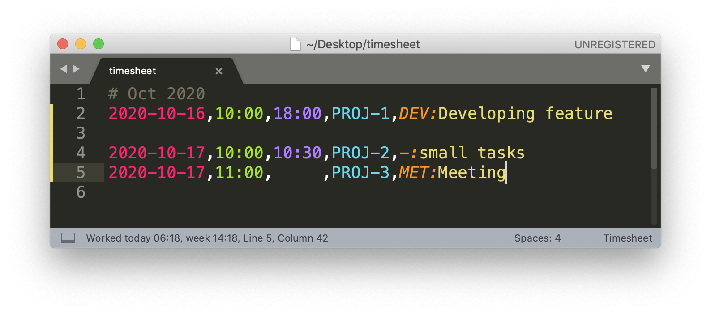

# Timesheets

[](https://travis-ci.org/demalexx/timesheets)
[](https://codecov.io/gh/demalexx/timesheets)

Sublime Text 3 package to help working with IPONWEB timesheets (Jira).
Features:

* Syntax highlight;
* Open ticket under cursor in default browser;
* Help adding new timesheet lines using shortcut;
* Show how much time is worked today and this week in status bar.



# Installation

Copy file [release/timesheets.sublime-package](https://github.com/demalexx/timesheets/raw/master/release/timesheets.sublime-package)
into Sublime package folder, depending on your OS.

*MacOS*

```
rm "$HOME/Library/Application Support/Sublime Text 3/Installed Packages/timesheets.sublime-package"
wget https://github.com/demalexx/timesheets/raw/master/release/timesheets.sublime-package -P "$HOME/Library/Application Support/Sublime Text 3/Installed Packages/"
```

*Ubuntu*

```
rm "$HOME/.config/sublime-text-3/Installed Packages/timesheets.sublime-package"
wget https://github.com/demalexx/timesheets/raw/master/release/timesheets.sublime-package -P "$HOME/.config/sublime-text-3/Installed Packages/"
```

*Windows*

```
Invoke-WebRequest -Uri https://github.com/demalexx/timesheets/raw/master/release/timesheets.sublime-package -OutFile "~/AppData/Roaming/Sublime Text 3/Installed Packages/timesheets.sublime-package"
```

# Usage

## Syntax highlight

To use syntax highlight select Timesheet from right bottom menu
of available syntaxes, or type "Set syntax: Timesheet"
in command palette (`Ctrl+Shift+P`, or `Cmd+Shift+P` on Mac).

If timesheet line has invalid format, it won't be highlighted
(e.g. missing comma, invalid date/time etc).
There is one exception - "time to" field could be filled with spaces
and line is highlighted as valid. Such line is considered as ticket 
you're working on right now, and finish time is not known yet.

## Open ticket in browser

If line contains valid ticket, you could open it in browser by:

* `Ctrl+Click` (`Alt+Click` on Mac) on any place on line;
* Select `Goto Ticket` in context menu.

## Shortcut to add timesheet lines

Shortcut `Alt+D` takes timesheet line under the cursor, 
clones it, modifies to reflect current date/time
and appends it to proper place. Also it fills empty time_to field.

It's easier to describe it through examples.

Suppose today is 2020-10-10 10:03 (`|` represents cursor position).

Before:
```
2020-10-01,10:00,12:00,PROJECT-123,working|
```

After:
```
2020-10-01,10:00,12:00,PROJECT-123,working

2020-10-10,10:00,     ,PROJECT-123,working|
```

- Blank line is inserted as separator between days;
- Original issue and comment is copied;
- Today is inserted;
- Current time is rounded and inserted as time_from;
- time_to field is left blank.

Suppose now is 11:08.

Before:
```
2020-10-01,10:00,12:00,PROJECT-123,"working"

2020-10-10,10:00,     ,PROJECT-123,"working|"
```

After:
```
2020-10-01,10:00,12:00,PROJECT-123,"working"

2020-10-10,10:00,11:00,PROJECT-123,"working"
2020-10-10,11:00,     ,PROJECT-123,"working|"
```

- Blank line is not inserted because it's same day;
- Original issue and comment is copied;
- Empty time_to is filled with rounded current time;
- time_to of original line is inserted as time_from;
- time_to field is left blank.

There is another shortcut `Alt+Shift+D` which does all the same
but doesn't copy issue and comment.

Before:
```
2018-01-01,10:00,12:00,|PROJECT-123,"working"
```

After:
```
2018-01-01,10:00,12:00,PROJECT-123,"working"

2018-01-10,10:00,     ,|,""
```

## Info about how much time is worked

Worked time today and this week is shown in status bar. 
It's updated automatically on tab activation or file save.

Examples: `Worked today 02:35, week 10:35` (hours:minutes).

If timesheet line has empty time_to field,
it's replaced with current time to calculate working time.

# Customization

Plugin has some settings accessible through
`Preferences → Package Settings → Timesheets → Settings`:

```javascript
{
    // Jira ticket URL, e.g.
    // "https://jira.example.com/browse/{}"
    "jira_ticket_url": "https://jira.iponweb.net/browse/{}"
}
```

Mouse bindings could be changed in
`Preferences → Package Settings → Timesheets → Mouse Bindings`:

Key bindings could be changed in
`Preferences → Package Settings → Timesheets → Key Bindings`:
