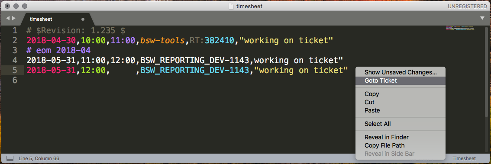

# Timesheets

Sublime Text 3 package to help working with IPONWEB timesheets.
It has two features:

* Syntax highlight;
* Ability to open ticket, that's under cursor, in browser.



Both RT and Jira tickets are supported.

# Installation

Copy file `timesheets.sublime-package` into
`<data_path>/Installed Packages/` folder:

* `~/Library/Application Support/Sublime Text 3/Installed Packages/`
  (MacOS);
* `~/.config/sublime-text-3/Installed Packages/` (Ubuntu);
* `~/AppData/Roaming/Sublime Text 3/Installed Packages/` (Windows).

# Usage

## Syntax highlight

To use syntax highlight select Timesheet from right bottom menu
of available syntaxes, or press `Ctrl+Shift+P` (`Cmd+Shift+P` on Mac)
and type "Set syntax: Timesheet".

If timesheet line has invalid format, it won't be highlighted
(e.g. missing comma or quote, letter instead of digit etc).
There is one exception - "time to" field could be filled with spaces
and line is highlighted as valid. Because it's considered as
ticket you're working on right now and finish time is not known yet.

## Open ticket in browser

If line contains valid ticket, you could open it in browser by:

* `Ctrl+Click` (`Alt+Click` on Mac) on any place on line;
* Select `Goto Ticket` in context menu. This menu item
  is visible only if line contains valid ticket.

# Customization

Plugin has few URLs settings accessible in
`Preferences → Package Settings → Timesheets → Settings`:

```json
{
    // Request Tracker (RT) ticket URL, e.g.
    // "https://rt.example.com/Ticket/Display.html?id={}"
    "rt_ticket_url": "https://www.iponweb.net/rt/Ticket/Display.html?id={}",

    // Jira ticket URL, e.g.
    // "https://jira.example.com/browse/{}"
    "jira_ticket_url": "https://jira.iponweb.net/browse/{}"
}
```

Modifier key could be changed in
`Preferences → Package Settings → Timesheets → Key Bindings`:

```json
[
    {
        "button": "button1",
        "modifiers": ["alt"],
        "count": 1,
        "press_command": "drag_select",
        "command": "goto_ticket"
    }
]
```